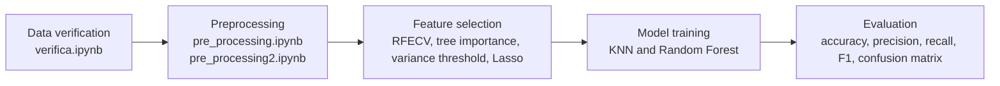
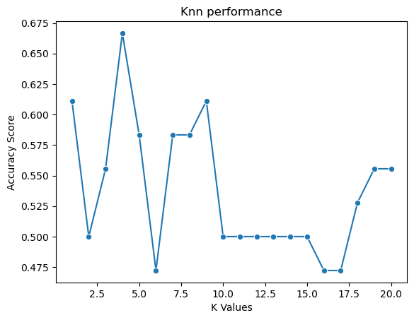
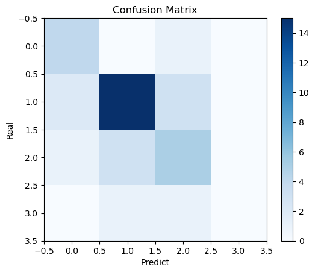
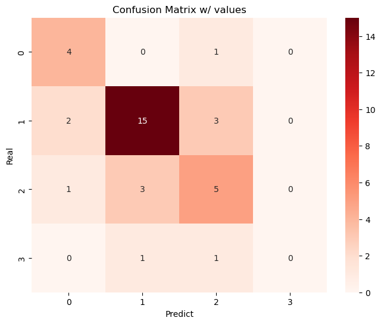
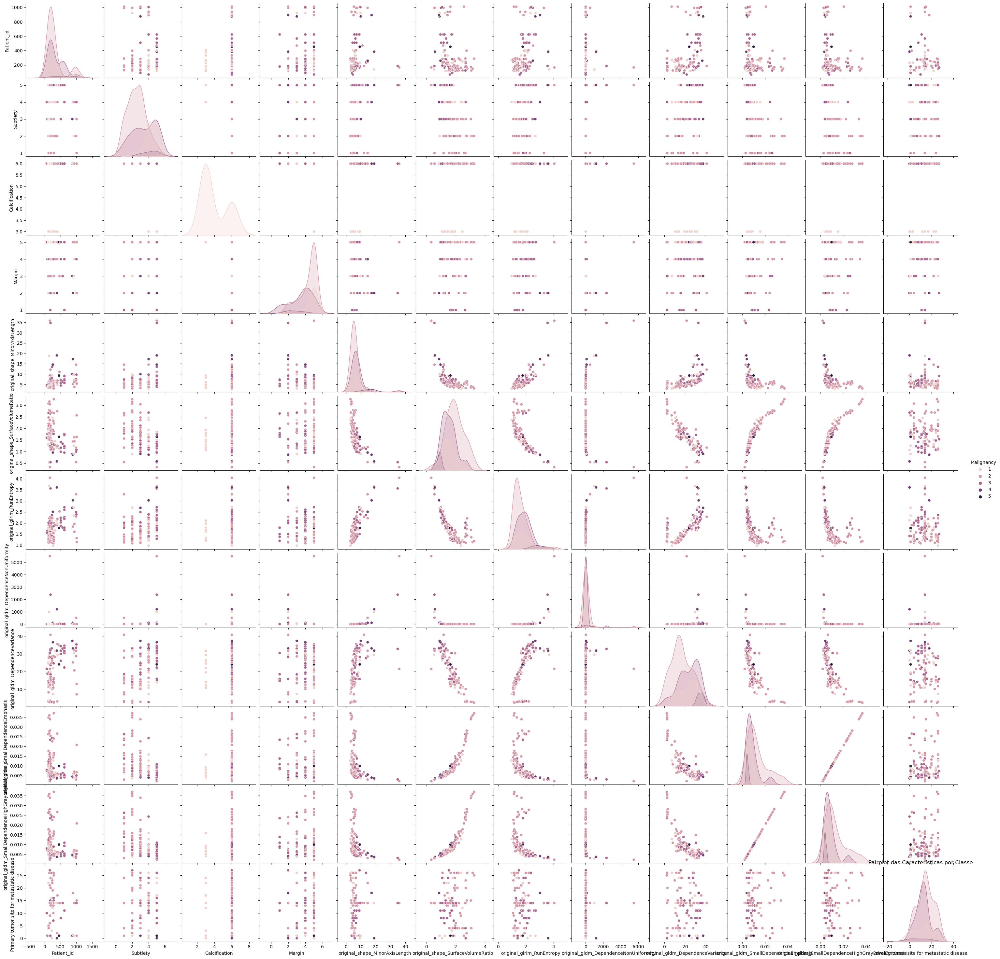
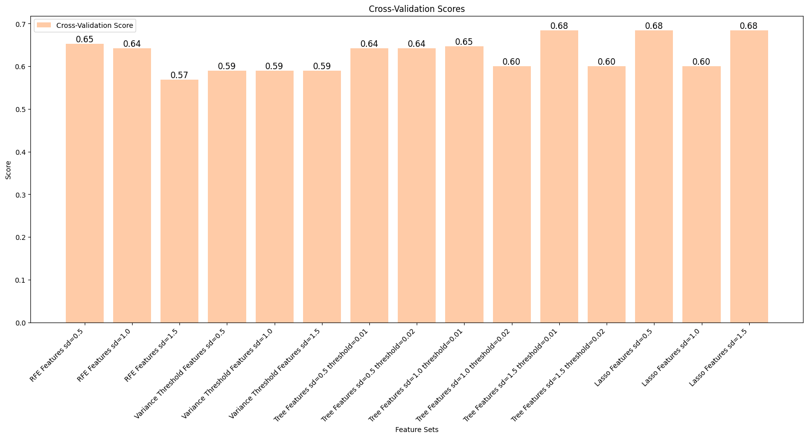

# Lung Cancer Radiomics Classification Project

Lung cancer classification using CT-derived radiomic and clinical features.

## Project Description

This project explores a multi-class lung cancer classification workflow built from the LIDC-IDRI-derived tables in this repository. The pipeline combines data verification, preprocessing, feature selection, and model evaluation to predict malignancy-related labels from structured CT feature sets.

The workspace includes three prepared feature tables (`data_0.5.csv`, `data_1.0.csv`, and `data_1.5.csv`) plus the source metadata files under `data/`. The notebooks are organized under `notebooks/` by pipeline stage and document the full analysis path from cleaning and validation to model comparison.

## Methodology

The analysis is organized as a notebook pipeline:



The main steps are:

1. Verify identifiers, duplicates, whitespace, and missing values in the metadata and feature tables.
2. Standardize and rename the nodule-level diagnosis columns so the feature tables can be reused consistently.
3. Compare multiple feature-selection strategies, including recursive feature elimination, tree-based feature importance, variance thresholding, and Lasso-based selection.
4. Train and compare classifiers, with a strong focus on KNN sweeps over different `k` values and confusion-matrix analysis.
5. Inspect class-wise precision, recall, and F1-score to identify where the model is stable and where it still struggles.

## Results

The notebook outputs show that model quality depends strongly on the chosen feature set. KNN accuracy varied across `k`, with peaks at `k = 4` in one run and `k = 6` in another, both visible in the performance sweeps below.

Feature-selection experiments produced the strongest cross-validation scores around `0.68`, reached by tree-based and Lasso-based feature sets on the highest standard-deviation table. RFE also stayed competitive, with scores in the mid `0.6` range on the lower-variance tables.

One representative KNN evaluation produced the following class-wise scores:

| Metric | Class 0 | Class 1 | Class 2 | Class 3 |
| --- | ---: | ---: | ---: | ---: |
| Precision | 0.57 | 0.79 | 0.50 | 0.00 |
| Recall | 0.80 | 0.75 | 0.56 | 0.00 |
| F1-score | 0.67 | 0.77 | 0.53 | 0.00 |

The same run produced this confusion matrix:

|  | Pred 0 | Pred 1 | Pred 2 | Pred 3 |
| --- | ---: | ---: | ---: | ---: |
| Real 0 | 4 | 0 | 1 | 0 |
| Real 1 | 2 | 15 | 3 | 0 |
| Real 2 | 1 | 3 | 5 | 0 |
| Real 3 | 0 | 1 | 1 | 0 |

### Figures

KNN sweep and confusion-matrix outputs:







Exploratory pairplot and feature-selection comparison:





## Reproducibility

To reproduce the notebook workflow:

1. Use Python 3.13 or newer.
2. Install the notebook dependencies:

	```bash
	pip install pandas numpy matplotlib seaborn scikit-learn jupyter
	```

3. Open and run the notebooks in this order:
	- `notebooks/00_verification/verifica.ipynb`
	- `notebooks/01_preprocessing/pre_processing.ipynb`
	- `notebooks/01_preprocessing/pre_processing2.ipynb`
	- `notebooks/01_preprocessing/features_pre_processing.ipynb`
	- `notebooks/02_feature_selection/feature_selection.ipynb`
	- `notebooks/03_modeling/trainingmodels.ipynb`

4. Keep the data files in place:
	- `data/MetaData.csv`
	- `data/primary.text`
	- `data_0.5.csv`
	- `data_1.0.csv`
	- `data_1.5.csv`

5. If you want to refresh the figures used in this README, rerun the notebooks and export the new plot outputs into `figures/`.

## Repository Layout

- `notebooks/00_verification/verifica.ipynb`: data quality checks and validation helpers.
- `notebooks/01_preprocessing/pre_processing.ipynb`, `notebooks/01_preprocessing/pre_processing2.ipynb`, and `notebooks/01_preprocessing/features_pre_processing.ipynb`: loading, cleaning, and column harmonization.
- `notebooks/02_feature_selection/feature_selection.ipynb`: RFECV, feature importance, variance threshold, and Lasso experiments.
- `notebooks/03_modeling/trainingmodels.ipynb`: classifier training, KNN sweeps, confusion matrices, and summary metrics.
- `requirements.txt`: Python dependencies for the notebook workflow.
- `figures/`: selected plots exported from notebook outputs for documentation.
